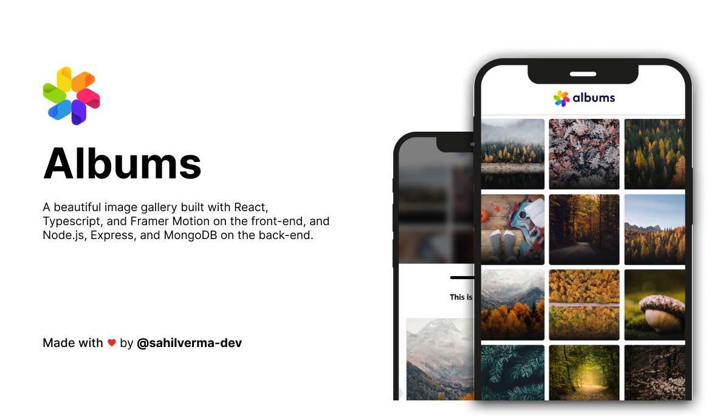
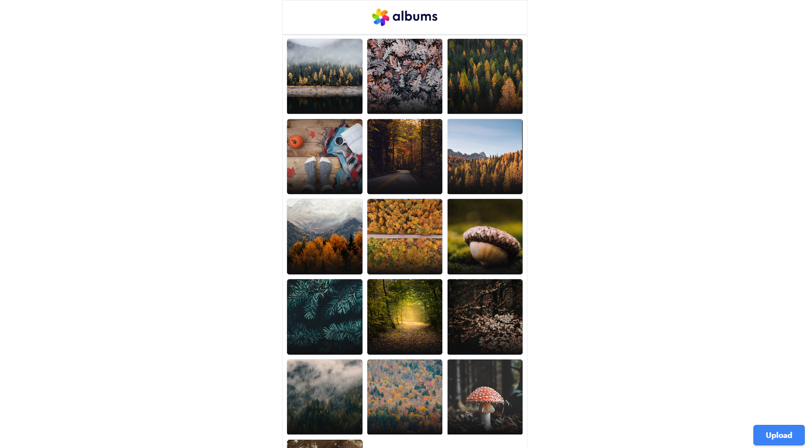
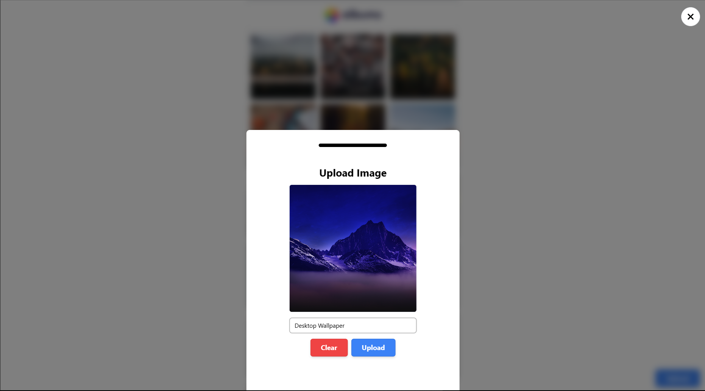

# Albums

A beautiful image gallery built with React, TypeScript, and Framer Motion on the frontend, and Node.js, Express, and MongoDB on the backend. This project uses IMGBB for image hosting and allows users to upload and view images with smooth animations and gesture controls.

## Features

- Good looking animations using Framer Motion
- Gesture controls for browsing images
- Carousel feature to easily navigate through images
- Image upload and download functionality

## Live URL

https://albums-ten.vercel.app/

## Installation

### Frontend

1. Navigate to the `client` folder
2. Install the dependencies by running `npm install`
3. Create a `.env` file based on the `.env.example` file and set the appropriate environment variables
4. Start the development server by running `npm run dev`
5. The frontend will be available at `http://localhost:3000`

### Backend

1. Navigate to the `server` folder
2. Install the dependencies by running `npm install`
3. Create a `.env` file based on the `.env.example` file and set the appropriate environment variables
4. Start the server by running `npm run dev`
5. The backend will be available at `http://localhost:5000`

## Screenshots

### Gallery

### Carousel

### Upload Form

### Upload Preview

## Contact

In case of any issues or for any other inquiries, please contact me at sahilverma.webdev@gmail.com
